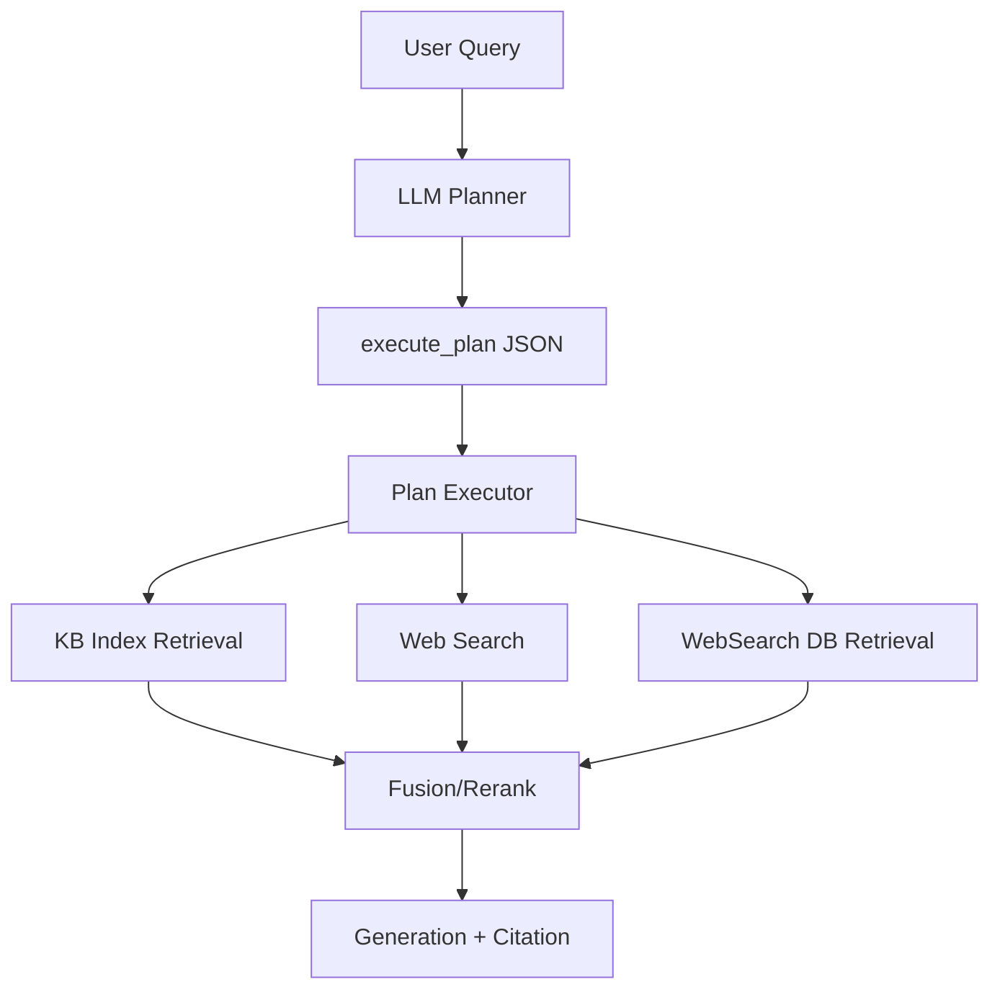

# LLM Planner 接入计划（面向 RAG + WebSearch 编排）

更新时间：2026-03-22

## 1. 背景与目标

现有规则路由在以下场景可能漏判：
- 输入：`电商如何选品`
- 期望命中：`电商选品核心方法论`
- 隐含链路：`如何` -> `方法` -> `核心方法论`

问题本质：用户输入与知识表达之间存在语义桥接，纯规则容易 miss。

目标：引入 `LLM Planner`，先产出 `execute_plan(JSON)`，再进入执行器，支持：
1. 是否/如何使用 web-search
2. 如何构造关键词（含桥接词）
3. 如何选择 KB / Web / WebSearch DB 三类源

---

## 2. 总体方案



---

## 3. Planner 职责定义

LLM Planner 只负责“计划”，不直接生成最终答案。

Planner 必须判别：
1. `need_web_search`
2. `route`（`kb_only | web_only | hybrid`）
3. `query_expansion`（core/synonym/bridge/negative/time）
4. `retrieval_plan`（source 组合、优先级、并行/串行、回退）
5. `fusion_plan`（`direct_fusion` or `rag_fusion`）

---

## 4. execute_plan(JSON) 协议（核心）

```json
{
  "plan_id": "uuid",
  "query": "电商如何选品",
  "intent": {
    "task_type": "method_guidance",
    "time_sensitivity": "low|medium|high",
    "domain": "cross_border_ecommerce",
    "risk_level": "low|medium|high"
  },
  "decision": {
    "need_web_search": false,
    "route": "kb_only|web_only|hybrid",
    "confidence": 0.0,
    "reasons": []
  },
  "query_expansion": {
    "core_terms": [],
    "bridge_terms": [],
    "synonyms": [],
    "negative_terms": [],
    "time_filters": {
      "enabled": false,
      "from": "",
      "to": ""
    }
  },
  "retrieval_plan": {
    "sources": [
      {
        "name": "kb_index",
        "enabled": true,
        "priority": 1,
        "top_k": 10
      },
      {
        "name": "web_search",
        "enabled": false,
        "priority": 2,
        "top_k": 10
      },
      {
        "name": "websearch_db_index",
        "enabled": false,
        "priority": 3,
        "top_k": 10
      }
    ],
    "execution_mode": "parallel|cascade",
    "fallback_policy": "kb_to_web|web_to_kb|none"
  },
  "fusion_plan": {
    "strategy": "direct_fusion|rag_fusion",
    "rerank": "rrf+grader",
    "context_top_k": 6
  },
  "observability": {
    "trace_tags": [],
    "debug": false
  }
}
```

---

## 5. 你的两个问题

## 5.1 什么时候可以认为“无需走KB，Web足以输出”

可判定 `route=web_only` 的建议条件（满足全部硬条件 + 至少1条增强条件）：

硬条件：
1. `time_sensitivity=high`（强时效：政策/规则/公告/活动）
2. `kb_freshness_miss=true`（KB 无近时窗文档，或版本过旧）
3. Web 结果质量达标：
- `web_top3_mean >= 0.75`
- `web_noise_ratio <= 0.25`
- `web_unique_domains >= 2`

增强条件（任一）：
1. `kb_pre_recall_low=true`（KB 预召回显著不足）
2. 查询明确要求“最新/近期/本周/本月政策”
3. 同一问题在近N次中 `web_only` 结果质量稳定优于 `kb_only`

保护条件（任一命中则禁止 web_only，改为 hybrid）：
1. 高风险场景（合规/法律/财税）
2. Web 结果源单一或冲突严重
3. 需要引用内部 SOP/私有知识

结论：`web_only` 是“受限策略”，默认优先 `hybrid`，仅在“高时效 + KB明显不新 + Web质量稳定”下启用。

## 5.2 桥接词是否由LLM自动判断？能否有确定规则？

结论：采用“规则优先 + LLM补全”的混合机制。

确定规则（必须先走）：
1. 意图词映射：
- `如何` -> `方法/步骤/框架/SOP`
- `为什么` -> `原因/机制/影响因素`
- `对比` -> `差异/优劣/适用场景`
2. 领域词映射：
- `选品` -> `选品方法/选品框架/选品指标`
- `爆品` -> `爆品方法论/爆品打造路径`
3. 词形扩展：简称、同义词、常见中英混写

LLM补全（规则后）：
1. 对规则扩展后的 query 生成最多 `K` 个候选桥接词
2. 通过检索可用性过滤（命中率/噪声）
3. 保留TopN进入 `bridge_terms`

这样可保证：
- 有确定下限（规则可解释、可回放）
- 有语义上限（LLM 补长尾表达）

---

## 6. 增加“可视化链路”的 Planner 模块

对当前 `fullchain-visualize` 增加 `planner` 阶段。

## 6.1 新增阶段

在现有 stages 中插入：
1. `planner_analyze`：意图/时效/领域/OOV 判别
2. `planner_build_plan`：生成并校验 `execute_plan`
3. `planner_route_decision`：输出 `kb_only/web_only/hybrid`

## 6.2 trace 新增字段

新增到 `trace.search.planner`：
- `plan_id`
- `decision.need_web_search`
- `decision.route`
- `decision.reasons`
- `query_expansion.bridge_terms`
- `retrieval_plan`
- `fusion_plan`
- `schema_valid`
- `fallback_used`

## 6.3 可视化返回示例（片段）

```json
{
  "stages": [
    {"stage": "planner_analyze", "status": "ok", "detail": {"time_sensitivity": "low"}},
    {"stage": "planner_build_plan", "status": "ok", "detail": {"schema_valid": true}},
    {"stage": "planner_route_decision", "status": "ok", "detail": {"route": "kb_only"}}
  ],
  "trace": {
    "search": {
      "planner": {
        "plan_id": "...",
        "decision": {"need_web_search": false, "route": "kb_only", "reasons": ["kb_recall_sufficient"]},
        "query_expansion": {"bridge_terms": ["选品方法", "选品框架", "核心方法论"]}
      }
    }
  }
}
```

---

## 7. 与 ../ECBot merge 兼容策略

1. 新增配置默认关闭：
- `search.planner_enabled=false`
- `search.planner_provider`
- `search.planner_timeout`
- `search.planner_max_retries`

2. 新增字段仅追加，不替换既有字段。  
3. Planner失败时：`fallback_used=true`，回退原有规则链路。

---

## 8. 两遍评测（确认版）

1. Eval-A（输入规划评测，Planner Eval）：
- `plan_route_accuracy`
- `web_trigger_recall`
- `web_trigger_precision`
- `keyword_bridge_hit_rate`

2. Eval-B（结果质量评测，RAG+融合 Eval）：
- 按 `../ECBot/Doc/Eval.md` 既有指标执行

发布建议：`A过线 + B不退化`。

---

## 9. DoD

1. `execute_plan` schema 固化并可校验  
2. `fullchain-visualize` 可展示 planner 三阶段  
3. 至少 1 个桥接 case（“电商如何选品”）稳定通过  
4. Planner 失败可自动回退旧链路
