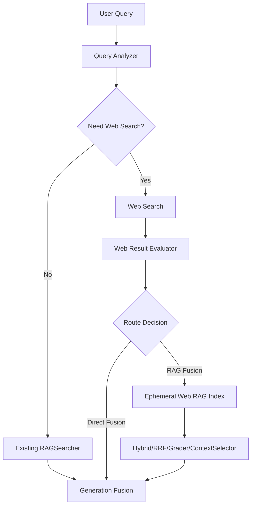

# 全网搜索接入计划（兼容 ECBot 合并）

更新时间：2026-03-22

## 1. 目标与范围

针对这类问题：
- 含强时效词：`最近`、`新政策`、`最新`、`今年`、`本月`等
- 含知识库外实体：如 `拉布布`、`哭哭马`

实现一个可控检索路由：
1. 先判断“是否需要全网搜索”
2. 执行全网搜索后，根据结果分布决定：
- `直接融合`（Web 结果直接入生成融合）
- `RAG-融合`（Web 结果先入临时RAG，再走现有 Hybrid/RRF/Grader/ContextSelector）

不在本计划范围：
- 不改动现有离线知识库构建主流程
- 不重构现有 ReActAgent 生成逻辑

---

## 2. 问题拆解

### 2.1 问题1：LLM 无法稳定判别“拉布布”类词

目标不是让 LLM“猜”词义，而是做**多信号判别**：
- A. 业务相关性（是否外贸电商语境）
- B. 知识库覆盖性（相关但库内缺失）
- C. 时效性（是否需要近期信息）

### 2.2 问题2：搜索返回规模不确定（海量 vs 精准）

需要一套路由规则，避免：
- 结果很少却强行走 RAG（收益低）
- 结果很多且噪声高却直接融合（幻觉风险高）

---

## 3. 方案总览

---

## 4. 核心判别设计（问题1）

## 4.1 Query Analyzer（新增）

输出结构（建议）：
- `temporal_intent_score`：时效意图分（0~1）
- `domain_relevance_score`：外贸电商相关分（0~1）
- `oov_entity_score`：疑似知识库外实体分（0~1）
- `kb_coverage_score`：知识库可覆盖分（0~1）
- `need_web_search`：最终是否触发全网搜索（bool）
- `reasons`：触发原因列表（用于 trace）

## 4.2 判别信号

1. 时效信号（规则优先）
- 命中词典：`最近/新政策/最新/近期/今年/本月/刚刚` 等
- 命中后提高 `temporal_intent_score`

2. 领域相关信号（轻量分类）
- 在 `QueryPreprocessor` 基础上，扩展外贸电商词表与类目词表
- 若 query 中出现实体词 + 外贸动作词（选品/爆品/供应链/关税/平台政策）共现，提升 `domain_relevance_score`

3. OOV 实体信号
- 对 query 中专有名词候选（中文连续词、英文品牌词）做检测
- 若该词在本地索引 `source/title/chunk` 命中率低（或为0），提升 `oov_entity_score`

4. 知识库覆盖信号
- 先执行一次低成本本地召回（如 `fts_top_k=5, vec_top_k=5`）
- 用 topN 结果的 `score/overlap/source_diversity` 估计 `kb_coverage_score`

## 4.3 触发规则（建议阈值）

`need_web_search = True` 当满足任一：
1. `temporal_intent_score >= 0.6`
2. `domain_relevance_score >= 0.5` 且 `oov_entity_score >= 0.6`
3. `kb_coverage_score < 0.35`

说明：该规则是“可解释优先”，避免把决策交给单次 LLM 判断。

---

## 5. 搜索结果路由设计（问题2）

## 5.1 Web Result Evaluator（新增）

对搜索结果计算：
- `result_count`：去重后文档数
- `top1_score/top3_mean`：头部相关性
- `score_gap`：`top1 - top5_mean`（判断是否精准）
- `domain_diversity`：来源域名多样性
- `freshness_ratio`：近期文档占比（如 90/180 天）
- `noise_ratio`：低质量页面占比（广告页/聚合页/内容过短）

## 5.2 路由规则

走 `直接融合`（Direct Fusion），当：
1. `result_count <= 8`
2. `top3_mean` 高（如 >= 0.72）
3. `score_gap` 明显（头部很准）
4. `noise_ratio` 低（如 <= 0.25）

走 `RAG-融合`，当满足任一：
1. `result_count > 8`（海量）
2. 主题分散（`domain_diversity` 高、`score_gap` 小）
3. 时效强但结论冲突（需要 chunk 级证据聚合）
4. 需要可追溯引用（政策/合规类）

兜底：
- Web 检索失败时回落现有本地 RAG 流程，并在 trace 标记 `web_fallback=true`

---

## 6. 与现有代码的集成点

基于当前链路：`RAGSearcher.search_with_trace -> ReActAgent.run_sync`

建议新增组件：
1. `src/core/search/query_analyzer.py`
2. `src/core/search/web_search_client.py`
3. `src/core/search/web_result_evaluator.py`
4. `src/core/search/web_router.py`

在 `ReActAgent.run_sync` 增加路由编排：
1. 先本地 `QueryAnalyzer`
2. 决定是否调用 `WebSearchClient`
3. 用 `WebRouter` 选择 `direct_fusion` 或 `rag_fusion`
4. 输出统一 `trace.search.web` 字段

---

## 7. Trace 与配置兼容（面向 ../ECBot merge）

## 7.1 配置兼容策略（必须）

遵循现有配置风格：
- 新增 `search.web_*` 配置，且默认关闭：
  - `web_search_enabled=false`
  - `web_search_provider`
  - `web_search_timeout`
  - `web_direct_fusion_thresholds`
  - `web_rag_max_docs`
- 新增环境变量前缀继续使用 `ECBOT_`
- 所有新字段提供默认值，保证旧 `config.json` 无感升级

## 7.2 返回结构兼容策略

不破坏现有 `AgentResponse` 与 `visualize_fullchain` 主结构，只追加：
- `trace.search.web.need_web_search`
- `trace.search.web.route` (`none/direct_fusion/rag_fusion`)
- `trace.search.web.reasons`
- `trace.search.web.metrics`
- `trace.search.web.fallback`

现有字段保持不变，避免影响 `tests/test_fastapi_gateway_*` 及上游调用方。

---

## 8. 分阶段落地

### Phase 0（低风险上线）
1. 仅实现 `QueryAnalyzer` + `need_web_search` 判别
2. 命中后先走 `direct_fusion`（限制 topN）
3. 打通 trace 与开关配置

### Phase 1（完整路由）
1. 引入 `WebResultEvaluator` + `WebRouter`
2. 支持 `direct_fusion` 与 `rag_fusion` 自动分流
3. 增加冲突信息识别与引用优先策略

### Phase 2（效果优化）
1. 阈值网格调参（基于评测集）
2. 实体词表/领域词表迭代
3. 加入缓存（query+time-window）降成本与提速

---

## 9. 测试计划

新增测试建议：
1. `tests/test_query_analyzer.py`
- 时效词触发
- OOV+领域相关触发
- 本地覆盖不足触发

2. `tests/test_web_router.py`
- 海量结果走 `rag_fusion`
- 精准结果走 `direct_fusion`
- 失败回退本地RAG

3. `tests/test_bot_generation_mode.py` 扩展
- 覆盖 `trace.search.web.route` 与 fallback 行为

---

## 10. 验收标准（Definition of Done）

1. 对“最近+新政策+知识库外实体”类问题，`need_web_search` 召回率可接受（先追求 Recall）
2. 路由决策可解释（trace 有明确 reasons + metrics）
3. 不破坏现有网关与 RAG 回退能力
4. 默认配置下行为与当前版本一致（兼容 `../ECBot` 合并）

